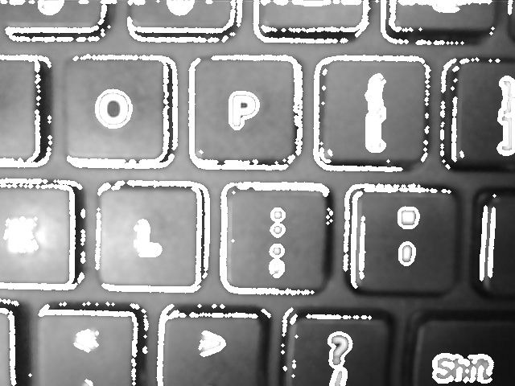

# esp-32cam

## pre-requirements

Clone esp-who repository:
https://github.com/espressif/esp-who/blob/master/README.md

1. Add this project under:

esp-who/examples/

2. connect esp cam and:
```
idf.py menuconfig
```

Set your WiFi SSID and Password here:
```Component config -> ESP Who configuration -> WiFi Configuration -> STA SSID and STA Password```

```
idf.py flash monitor
```

Check logs for IP address of camera:
I (1840) camera wifi: got ip:192.168.88.11

3. go to page in your browser: http://192.168.88.11

4. Examples of adding shapes (white thick border) to original grey photo





